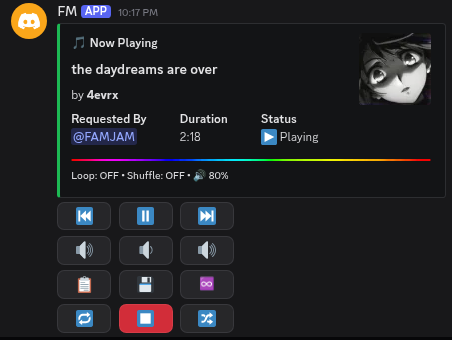

# FM Music Bot


Discord музыкальный бот с поддержкой YouTube, SoundCloud, Spotify и TikTok



---

## Возможности


- Плейлисты до 50 треков, YouTube Mix
- Несколько ссылок за один `/play` — каждая на новой строке
- Управление через кнопки без slash-команд
- Очередь с историей треков
- Loop — повтор текущего трека
- Shuffle — случайный порядок
- Громкость сохраняется между сессиями
- Сохранить трек — отправляет ссылки в ЛС
- Обложки треков из YouTube, Spotify и TikTok

---

## Установка

### Требования

- [Node.js](https://nodejs.org/) v18+
- [yt-dlp](https://github.com/yt-dlp/yt-dlp)
- [FFmpeg](https://ffmpeg.org/)

```bash
# Ubuntu / Debian
sudo apt install ffmpeg
pip3 install yt-dlp
```

### 1. Клонировать репозиторий

```bash
git clone https://github.com/FAMJAM1/music-bot_discord
cd music-bot_discord
npm install
```

### 2. Настроить .env

Создай файл `.env` в папке с ботом:

```env
TOKEN=твой_discord_bot_токен
SPOTIFY_CLIENT_ID=твой_spotify_client_id
SPOTIFY_CLIENT_SECRET=твой_spotify_client_secret
SPOTIFY_REFRESH_TOKEN=получается_через_spotify-auth.js
```

- Токен бота — [Discord Developer Portal](https://discord.com/developers/applications)
- Spotify credentials — [Spotify Developer Dashboard](https://developer.spotify.com/dashboard)

### 3. Получить Spotify Refresh Token

```bash
node spotify-auth.js
```

Открой ссылку из консоли в браузере, авторизуйся — токен запишется в `.env` автоматически

### 4. Cookies (опционально)

Для обхода ограничений YouTube положи файл `cookies.txt` в папку с ботом
Экспортировать можно через расширение [Get cookies.txt](https://chromewebstore.google.com/detail/get-cookiestxt-locally/cclelndahbckbenkjhflpdbgdldlbecc) в Chrome

### 5. Запустить

```bash
node index.js
```

### Автозапуск через systemctl (Linux)

```bash
sudo nano /etc/systemd/system/music-bot.service
```

```ini
[Unit]
Description=Discord Music Bot
After=network.target

[Service]
User=root
WorkingDirectory=/root/FMmusic
ExecStart=/usr/bin/node index.js
Restart=always
RestartSec=5

[Install]
WantedBy=multi-user.target
```

```bash
sudo systemctl daemon-reload
sudo systemctl enable music-bot
sudo systemctl start music-bot
```

---

## Управление

| Кнопка | Действие |
|--------|----------|
| ⏮ | Предыдущий трек |
| ⏸ / ▶️ | Пауза / Возобновить |
| ⏭ | Следующий трек |
| 🔇 | Мут |
| 🔉 / 🔊 | Громкость |
| 📋 | Показать очередь |
| 💾 | Сохранить трек в ЛС |
| ♾️ | Повтор |
| 🔁 | Перезапустить трек |
| ⏹ | Стоп |
| 🔀 | Рандом |

---

## Команды

| Команда | Описание |
|---------|----------|
| `/play [запрос или ссылка]` | Воспроизвести трек или плейлист |
| `/play [ссылка1\nссылка2]` | Несколько ссылок сразу |
| `/search [запрос]` | Поиск на YouTube с выбором из 5 результатов |

---

## Стек


