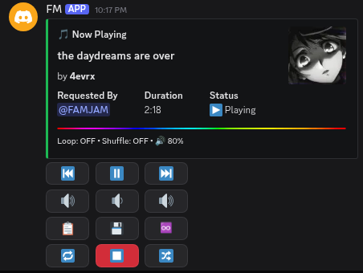

# FM Music Bot


Discord музыкальный бот с поддержкой YouTube, SoundCloud, Spotify, TikTok и Telegram



---

## Возможности


- Плейлисты до 50 треков, YouTube Mix
- Плейлисты Spotify (публичные всегда, приватные — с `SPOTIFY_SP_DC`), до 100 треков
- Несколько ссылок за один `/play` — каждая на новой строке (можно вставлять даже целиком код `<iframe>` от Spotify — бот сам вытащит ссылку)
- Управление через кнопки без slash-команд
- Панель управления доступна в нескольких каналах одновременно (`/menu`)
- Очередь с историей треков (до 10)
- Предзагрузка следующего трека в фоне
- Повтор текущего трека
- Случайный порядок
- Громкость сохраняется между сессиями
- Сохранить трек — отправляет ссылки в ЛС
- Обложки треков
- Режим онлайн — бот остаётся в канале после окончания очереди

---

## Установка

### Требования

- [Node.js](https://nodejs.org/) v18+
- [yt-dlp](https://github.com/yt-dlp/yt-dlp)
- [FFmpeg](https://ffmpeg.org/)

```bash
# Ubuntu / Debian
sudo apt install ffmpeg
pip3 install yt-dlp
```

### 1. Клонировать репозиторий

```bash
git clone https://github.com/FAMJAM1/music-bot_discord
cd music-bot_discord
npm install
```

### 2. Настроить .env

Создай файл `.env` в папке с ботом:

```env
TOKEN=твой_discord_bot_токен
SPOTIFY_CLIENT_ID=твой_spotify_client_id
SPOTIFY_CLIENT_SECRET=твой_spotify_client_secret
SPOTIFY_REFRESH_TOKEN=получается_через_spotify-auth.js
TG_API_ID=твой_telegram_api_id
TG_API_HASH=твой_telegram_api_hash
TG_SESSION=получается_через_tg-auth.js
SPOTIFY_SP_DC=опционально_для_приватных_плейлистов
```

- Токен бота — [Discord Developer Portal](https://discord.com/developers/applications)
- Spotify credentials — [Spotify Developer Dashboard](https://developer.spotify.com/dashboard)
- Telegram API — [my.telegram.org](https://my.telegram.org)

### 3. Авторизация Spotify

```bash
node spotify-auth.js
```

**Приватные плейлисты Spotify** (опционально): официальный API не даёт доступа к чужим и приватным плейлистам (ограничение Development mode). Бот автоматически переходит на публичную embed-страницу Spotify, но для приватных плейлистов ей тоже нужна авторизация

Чтобы бот видел твои приватные плейлисты — добавь cookie `sp_dc` из браузера:
1. Открой [open.spotify.com](https://open.spotify.com) и залогинься
2. F12 → Application → Cookies → open.spotify.com → скопируй значение `sp_dc`
3. Добавь в `.env`: `SPOTIFY_SP_DC=значение`

⚠️ Этот cookie даёт доступ к твоему аккаунту — никому не показывай его и не публикуй (я тебя предупредил)

**Несколько Spotify-аккаунтов** (для ботов на разных серверах с разными владельцами): можно добавить несколько cookie сразу:

```env
SPOTIFY_SP_DC=основной_аккаунт
SPOTIFY_SP_DC_1=аккаунт_друга_1
SPOTIFY_SP_DC_2=аккаунт_друга_2
```

Каждый сервер выбирает свой аккаунт командой:
```
/settings spotify_account номер:1
```

Если ничего не настроено — используется `SPOTIFY_SP_DC` по умолчанию для всех серверов. `номер:0` отключает привязку и возвращает дефолтный аккаунт

### 4. Авторизация Telegram

```bash
node tg-auth.js
```

### 5. Cookies (обязательно для YouTube/SoundCloud)

Положи файл `cookies.txt` в папку с ботом. Экспортировать можно через расширение [Get cookies.txt](https://chromewebstore.google.com/detail/get-cookiestxt-locally/cclelndahbckbenkjhflpdbgdldlbecc) в Chrome

**Важно:** YouTube периодически ротирует cookies по соображениям безопасности — если бот перестал качать треки, обнови `cookies.txt` заново тем же способом.

**SoundCloud rate limit:** при слишком частых запросах (например много плейлистов подряд) SoundCloud может временно заблокировать IP сервера с ошибкой `429 Too Many Requests`. Это не баг бота — блокировка снимается сама обычно в течение 1-2 часов

### 6. Запустить

```bash
node index.js
```

### Автозапуск через systemctl (Linux)

```bash
sudo nano /etc/systemd/system/music-bot.service
```

```ini
[Unit]
Description=Discord Music Bot
After=network.target

[Service]
User=root
WorkingDirectory=/root/FMmusic
ExecStart=/usr/bin/node index.js
Restart=always
RestartSec=5

[Install]
WantedBy=multi-user.target
```

```bash
sudo systemctl daemon-reload
sudo systemctl enable music-bot
sudo systemctl start music-bot
```

---

## Управление

| Кнопка | Действие |
|--------|----------|
| ⏮ | Предыдущий трек |
| ⏸ / ▶️ | Пауза / Возобновить |
| ⏭ | Следующий трек |
| 🔇 | Мут |
| 🔉 / 🔊 | Громкость |
| 📋 | Показать очередь |
| 💾 | Сохранить трек в ЛС |
| ♾️ | Повтор |
| 🔁 | Перезапустить трек |
| ⏹ | Стоп |
| 🔀 | Случайный порядок |

---

## Команды

| Команда | Описание |
|---------|----------|
| `/play [запрос или ссылка]` | Воспроизвести трек или плейлист |
| `/search [запрос]` | Поиск на YouTube с выбором из 5 результатов |
| `/menu` | Открыть панель управления в текущем канале |
| `/online` | Бот заходит в канал и не выходит пока не скажешь `/offline` |
| `/offline` | Бот выходит из голосового канала |
| `/settings prefetch` | Включить/выключить предзагрузку треков |
| `/settings spotify_account` | Выбрать Spotify-аккаунт для приватных плейлистов на этом сервере |

---

## Стек


